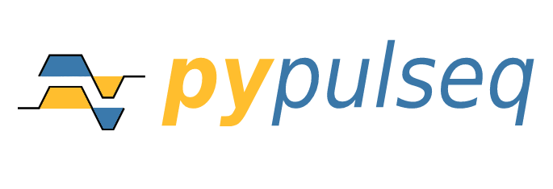

<p align="center">



</p>

# PyPulseq: A Python Package for MRI Pulse Sequence Design

`Compatible with Pulseq 1.4.0`


🚨🚨🚨 **NOTE:** This is the `dev` branch which hosts the bleeding edge version. For the most recent, stable release,
switch to the `master` branch by clicking [here](https://github.com/imr-framework/pypulseq/tree/master). 🚨🚨🚨

## Table of contents 🧾
1. [👥 Contributors][section-contributors]
2. [📚 Citations][section-relevant-literature]
3. [🔨 Installation][section-installation]
4. [⚡ Lightning-start - PyPulseq in your browser!][section-lightning-start]
5. [🏃‍♂ Quickstart - example scripts][section-quickstart-examples]
6. [🤿 Deep dive - custom pulse sequences][section-deep-dive]
7. [👥 Contributing and Community guidelines][section-contributing]
8. [📖 References][section-references]
9. [📃 API documentation][api-docs]

---

Pulse sequence design is a significant component of MRI research. However, multi-vendor studies require researchers to
be acquainted with each hardware platform's programming environment.

PyPulseq enables vendor-neutral pulse sequence design in Python [[1,2]][section-references]. The pulse sequences can be
exported as a `.seq` file to be run on  Siemens/[GE]/[Bruker] hardware by leveraging their respective
Pulseq interpreters. This tool is targeted at MRI pulse sequence designers, researchers, students and other interested
users. It is a translation of the Pulseq framework originally written in Matlab [[3]][section-references].

👉 Currently, PyPulseq is compatible with Pulseq 1.4.0. 👈

It is strongly recommended to first read the [Pulseq specification]  before proceeding. The specification
document defines the concepts required for pulse sequence design using PyPulseq.

If you use PyPulseq in your work, cite the following publications:
```
Ravi, Keerthi, Sairam Geethanath, and John Vaughan. "PyPulseq: A Python Package for MRI Pulse Sequence Design." Journal
of Open Source Software 4.42 (2019): 1725.

Ravi, Keerthi Sravan, et al. "Pulseq-Graphical Programming Interface: Open source visual environment for prototyping
pulse sequences and integrated magnetic resonance imaging algorithm development." Magnetic resonance imaging 52 (2018):
9-15.
```

## 📢 Pulse sequence development in your browser!
Design pulse sequences using `pypulseq` in your browser! Check out the [⚡ Lightning-start][section-lightning-start] section to
learn how!

## 1. 👥 Contributors (alphabetical)
- @bilal-tasdelen
- @calderds
- @mavel101
- @nnmurthy
- @sairamgeethanath
- @schuenke
- @skarrea
- @tonggehua

Please email me/submit PR/open an issue if any contributors are missing.

## 2. 📚 [Citations][scholar-citations] (reverse chronological)
1. Hennig, J., Barghoorn, A., Zhang, S. and Zaitsev, M., 2022. Single shot spiral TSE with annulated segmentation.
Magnetic Resonance in Medicine.
2. Niso, G., Botvinik-Nezer, R., Appelhoff, S., De La Vega, A., Esteban, O., Etzel, J.A., Finc, K., Ganz, M., Gau, R.,
Halchenko, Y.O. and Herholz, P., 2022. Open and reproducible neuroimaging: from study inception to publication.
3. Tong, G., Gaspar, A.S., Qian, E., Ravi, K.S., Vaughan, J.T., Nunes, R.G. and Geethanath, S., 2022. Open-source
magnetic resonance imaging acquisition: Data and documentation for two validated pulse sequences. Data in Brief, 42,
p.108105.
4. Tong, G., Gaspar, A.S., Qian, E., Ravi, K.S., Vaughan Jr, J.T., Nunes, R.G. and Geethanath, S., 2022. A framework
for validating open-source pulse sequences. Magnetic resonance imaging, 87, pp.7-18.
5. Karakuzu, A., Appelhoff, S., Auer, T., Boudreau, M., Feingold, F., Khan, A.R., Lazari, A., Markiewicz, C., Mulder,
M.J., Phillips, C. and Salo, T., 2021. qMRI-BIDS: an extension to the brain imaging data structure for quantitative
magnetic resonance imaging data. medRxiv.
6. Karakuzu, A., Biswas, L., Cohen‐Adad, J. and Stikov, N., 2021. Vendor‐neutral sequences and fully transparent
workflows improve inter‐vendor reproducibility of quantitative MRI. Magnetic Resonance in Medicine.
7. Geethanath, S., Single echo reconstruction for rapid and silent MRI. (ISMRM) (2021).
8. Qian, E. and Geethanath, S., Open source Magnetic rEsonance fingerprinting pAckage (OMEGA). (ISMRM) (2021).
9. Ravi, K.S., O'Reilly, T., Vaughan Jr, J.T., Webb, A. and Geethanath, S., Seq2prospa: translating PyPulseq for
low-field imaging. (ISMRM) (2021).
10. Ravi, K.S., Vaughan Jr, J.T. and Geethanath, S., PyPulseq in a web browser: a zero footprint tool for collaborative
and vendor-neutral pulse sequence development. (ISMRM) (2021).
11. Ravi, K.S. and Geethanath, S., 2020. Autonomous magnetic resonance imaging. Magnetic Resonance Imaging, 73,
pp.177-185.
12. Nunes, Rita G., et al. "Implementation of a Diffusion-Weighted Echo Planar Imaging sequence using the Open Source
Hardware-Independent PyPulseq Tool." ISMRM & SMRT Virtual Conference & Exhibition, International Society for Magnetic
Resonance in Medicine (ISMRM) (2020).
13. Loktyushin, Alexander, et al. "MRzero--Fully automated invention of MRI sequences using supervised learning." arXiv
preprint arXiv:2002.04265 (2020).
14. Jimeno, Marina Manso, et al. "Cross-vendor implementation of a Stack-of-spirals PRESTO BOLD fMRI sequence using
TOPPE and Pulseq." ISMRM & SMRT Virtual Conference & Exhibition, International Society for Magnetic Resonance in
Medicine (ISMRM) (2020).
15. Clarke, William T., et al. "Multi-site harmonization of 7 tesla MRI neuroimaging protocols." NeuroImage 206 (2020): 116335.
16. Geethanath, Sairam, and John Thomas Vaughan Jr. "Accessible magnetic resonance imaging: a review." Journal of
Magnetic Resonance Imaging 49.7 (2019): e65-e77.
17. Tong, Gehua, et al. "Virtual Scanner: MRI on a Browser." Journal of Open Source Software 4.43 (2019): 1637.
18. Archipovas, Saulius, et al. "A prototype of a fully integrated environment for a collaborative work in MR sequence
development for a reproducible research." ISMRM 27th Annual Meeting & Exhibition, International Society for
Magnetic Resonance in Medicine (ISMRM) (2019).
19. Pizetta, Daniel Cosmo. PyMR: a framework for programming magnetic resonance systems. Diss. Universidade de São
Paulo (2018).
---

## 3. 🔨 Installation
\>=Python 3.6, virtual environment recommended:

```pip install pypulseq```

## 4. ⚡ Lightning-start - PyPulseq in your browser!
1. Create a new notebook on [Google Colab][google-colab]
2. [Install][section-installation] PyPulseq
3. Get going!

Or, explore an example notebook:
1. Copy URL of an example notebook from [here][section-notebook-examples]
2. On [Google Colab][google-colab], insert the copied link to get started

## 5. 🏃‍♂ Quickstart - example scripts
Every example script creates a pulse sequence, plots the pulse timing diagram and writes a `.seq` file to disk.
1. [Install][section-installation] PyPulseq
2. Download and run any of the [example][script-examples] scripts.

## 6. 🤿 Deep dive - custom pulse sequences
Getting started with pulse sequence design using `PyPulseq` is simple:
1. [Install][section-installation] PyPulseq
2. First, define system limits in `Opts` and then create a `Sequence` object with it:
    ```python
    import pypulseq as pp

    system = pp.Opts(max_grad=32, grad_unit='mT/m', max_slew=130, slew_unit='mT/m/ms')
    seq = pp.Sequence(system=system)
    ```
3. Then, design gradient, RF or ADC pulse sequence events:
    ```python
    Nx, Ny = 256, 256 # matrix size
    fov = 220e-3 # field of view
    delta_k = fov / Nx

    # RF sinc pulse with a 90 degree flip angle
    rf90 = pp.make_sinc_pulse(flip_angle=90, duration=2e-3, system=system, slice_thickness=5e-3, apodization=0.5,
       time_bw_product=4)

    # Frequency encode, trapezoidal event
    gx = pp.make_trapezoid(channel='x', flat_area=Nx * delta_k, flat_time=6.4e-3, system=system)

    # ADC readout
    adc = pp.make_adc(num_samples=Nx, duration=gx.flat_time, delay=gx.rise_time, system=system)
    ```
4. Add these pulse sequence events to the `Sequence` object from step 2. One or more events can be executed
simultaneously, simply pass them all to the `add_block()` method. For example, the `gx` and `adc` pulse sequence events
need to be executed simultaneously:
    ```python
    seq.add_block(rf90)
    seq.add_block(gx, adc)
    ```
5. Visualize plots:
    ```python
    seq.plot()
    ```
6. Generate a `.seq` file to be executed on a real MR scanner:
    ```python
    seq.write('demo.seq')
    ```

**Get in touch regarding running the `.seq` files on your Siemens/[GE]/[Bruker] scanner.**

## 7. 👥 Contributing and Community guidelines
`PyPulseq` adheres to a code of conduct adapted from the [Contributor Covenant] code of conduct.
Contributing guidelines can be found [here][contrib-guidelines].

## 8. 📖 References
1. Ravi, Keerthi, Sairam Geethanath, and John Vaughan. "PyPulseq: A Python Package for MRI Pulse Sequence Design."
Journal of Open Source Software 4.42 (2019): 1725.
2. Ravi, Keerthi Sravan, et al. "Pulseq-Graphical Programming Interface: Open source visual environment for prototyping
pulse sequences and integrated magnetic resonance imaging algorithm development." Magnetic resonance imaging 52 (2018):
9-15.
3. Layton, Kelvin J., et al. "Pulseq: a rapid and hardware‐independent pulse sequence prototyping framework." Magnetic
resonance in medicine 77.4 (2017): 1544-1552.

[Bruker]: https://github.com/pulseq/bruker_interpreter
[Contributor Covenant]: http://contributor-covenant.org
[GE]: https://toppemri.github.io
[Pulseq specification]: https://pulseq.github.io/specification.pdf
[api-docs]: https://pypulseq.readthedocs.io/
[contrib-guidelines]: https://github.com/imr-framework/pypulseq/blob/master/CONTRIBUTING.md
[google-colab]: https://colab.research.google.com/
[scholar-citations]: https://scholar.google.com/scholar?oi=bibs&hl=en&cites=16703093871665262997
[script-examples]: https://github.com/imr-framework/pypulseq/tree/dev/pypulseq/seq_examples/scripts
[section-contributors]: #1--contributors-alphabetical
[section-contributing]: #7--contributing-and-community-guidelines
[section-deep-dive]: #6--deep-dive---custom-pulse-sequences
[section-installation]: #3--installation
[section-lightning-start]: #4--lightning-start---pypulseq-in-your-browser
[section-quickstart-examples]: #5--quickstart---example-scripts
[section-references]: #8--references
[section-relevant-literature]: #2--citations-reverse-chronological
