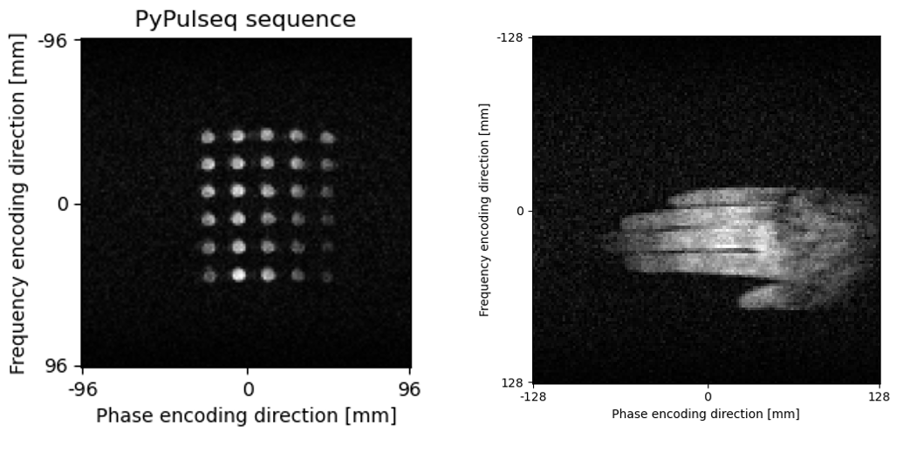
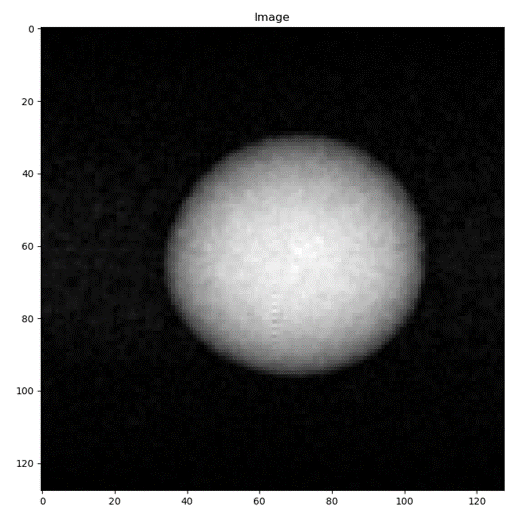

<p align="center">

</p>

# seq2prospa for PyPulseq

`seq2prospa` is a tool that enables users to convert `.seq` files generated using [`PyPulseq`][pypulseq] into a 
Prospa-friendly format. The Prospa software is Magritek's programmable macro language and programming environment to 
develop pulse sequences for the [Kea2][kea2] spectrometer.

If you use `seq2prospa` in your work, cite as:
```
Ravi, Keerthi Sravan, Thomas O'Reilly, John Thomas Vaughan Jr., Andrew Webb, and Sairam Geethanath. "Seq2prospa: translating 
PyPulseq for low-field imaging". ISMRM 28th Annual Meeting & Exhibition, 2021. 
```

## Supported sequences

Currently, `seq2prospa` has been tested on Gradient Recalled Echo (GRE) and Spin Echo (SE) pulse sequences. Shown below 
are reconstructions of data acquired using converted GRE and SE pulse sequences using the Kea2 spectrometer.

GRE (structural phantom and human hand):



SE (phantom):



## Instructions

   1. `pip install pypulseq`. 
   2. Run `seq2prospa.py`; make sure to choose the desired sequence by commenting out the relevant line.  

## Contributing and Community guidelines
`PyPulseq` adheres to a code of conduct adapted from the [Contributor Covenant] code of conduct.
Contributing guidelines can be found [here][contrib-guidelines].

[Contributor Covenant]: http://contributor-covenant.org
[contrib-guidelines]: https://github.com/imr-framework/pypulseq/blob/master/CONTRIBUTING.md
[kea2]: https://magritek.com/products/kea/
[pypulseq]: https://github.com/imr-framework/pypulseq