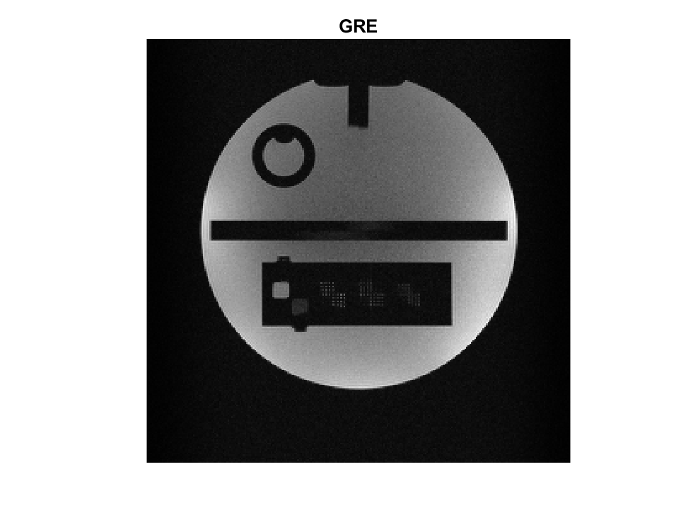
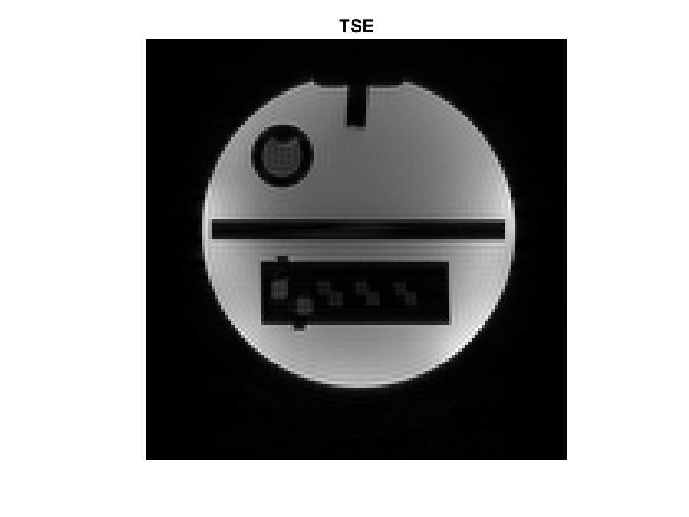

# PyPulseq: A Python Package for MRI Pulse Sequence Design

Example reconstructions of the Gradient Recalled Echo (GRE) and Turbo Spin Echo (TSE) sequences executed on a 
Siemens Prisma 3T scanner:

### 1. Gradient Recalled Echo (GRE)

| Parameter | Value |
|-----------|-------|
| Field of view | 256 x 256 mm^-3 |
| Nx | 256 |
| Ny | 256 |
| Flip angle | 10 |
| Number of slices | 1 |
| Slice thickness | 3 mm |
| TE | 4.3 ms |
| TR | 10 ms |
| Number of echoes | 16 |

---

### 2. Turbo Spin Echo (TSE)

| Parameter | Value |
|-----------|-------|
| Field of view | 256 x 256 mm^-3 |
| Nx | 128 |
| Ny | 128 |
| Flip angle | 10 |
| Number of slices | 1 |
| Slice thickness | 5 mm |
| TE | 12 ms |
| TR | 2000 ms |

